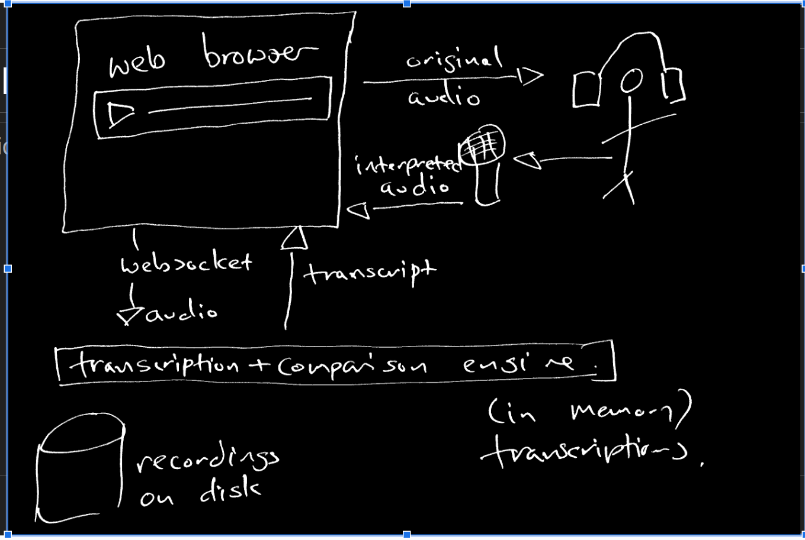

# Terplounge, a tool to practise oral interpretation

This repository contains the source code to Terplounge, a tool to allow solitary practise of simultaneous interpretation.

## Overview

Terplounge is a tool which allows simultaneous interpreters to practice alone. It works by having audio and video of people speaking in one language, and a set of one or more translation transcripts in other languages. The user speaks into their microphone and Terplounge automatically transcribes what they say, and compares it to the 'official' translation. It's important to note that the system doesn't judge the correctness or otherwise of the users' translation, it simply compares it to the official translation.

## Technical overview

The application consists of two parts, a server which exposes an API, and HTML/CSS/Javascript code which uses this API to provide a UX. The client-side (HTML) code serves two purposes: as an example of how to use the API, and as useable application in its own right. The front-end is bundled inside the server binary, making Terplounge usable by just downloading it to users' machines.

## The server

The backend ('server') is written in Rust, a high-performance language with memory-safety guarantees. The system is written to allow a choice of transcription engines--Whisper, an open-source speech-to-text system is bundled within the system, it performs relatively well on normal desktop hardware. The capability exists within the system for it to be used with commercial speech to text systems, or by integrating a system which uses a GPU to work more quickly.

Audio is sent to the server by calling the `/chat` endpoint and specifying the user's sample rate. Data is sent as a raw sequence of mono 32-bit floats, little-endian, with no container or header. The server responds initially with a JSON object with this session's UUID:

```
{"uuid":"354f6692-8aa8-4d9e-aa84-766689c85146"}
```

followed by a sequence of chunks like this:
```
{"num_segments":3,"segment_end":720,"segment_number":0,"segment_start":0,"sequence_number":1,"translation":" Wir feiern heute nicht den Sieg einer Partei, sondern die Freiheit.","uuid":"5055d383-6b80-4427-9865-242f878c71bf"}
```
as the transcription proceeds.

After a period of 15 seconds in which no data is sent, the server side will automatically close the connection.

There are fundamentally two ways to use the server, although one doesn't need to choose one or the other. In the first, transcriptions are created which can be used to build up a library for users to practice with. In the second, the transcription is compared with a reference and the differences between the two are returned. In both cases the transcript itself and a WAV file of the user's audio are stored on the machine hosting the server — but only if `RECORDINGS_DIR` is set. Leave it unset and nothing is written to disk at all.

In all cases the UUID returned by the websocket is used to identify the session. Apart from the inherent unguessability of the UUID there is no security implemented, the intention being that this would be provided by layers on top of the basic API, if needed.

The calls which can be made with the UUID are:

- `/chat?lang=XX&resource=YYY&rate=ZZZZ`

	`lang` is a 2-letter language code, for instance `de`. It defaults to `de` if not specified. `rate` is the sample rate of the audio you are about to send and defaults to 44,100 — get this wrong and the audio is resampled by the wrong ratio, which degrades the transcription rather than failing outright. Optionally `resource` identifies a resource bundle, as described below.

- `/close/:uuid`
  marks the session for closure when all outstanding transcriptions have been completed.

- `/serve_resource/:resource_path`
	Returns the bundle's audio file, supporting HTTP range requests so a browser can seek within it. If the path begins with `/` then it will be interpreted as the exact path to a resource bundle, if not then it will be relative to the resource root, which is specified using the `ASSETS_DIR` environment variable.

- `/status/:uuid`
Returns a JSON object in this form:

	```{"language":"en","uuid":"2d82da3a-e2fc-4728-8c78-3f52481bfbe2","resource":null,"sample_rate":48000,"recording":true,"transcription_job_count":7,"transcription_completed_count":0}```

	`transcription_job_count` here can be compared with `transcription_completed_count` to get an idea of how the transcription process is proceeding and give feedback to the user. There is sample code for this in `server/templates/compare.html`. Note that these two counters are the only progress signal — there is no `sequence_number` or `last_sequence` field.

- `/compare/:resource_id/:uuid/:lang`
Renders an HTML page comparing the transcript stored for this session (which may be incomplete, when transcription tasks are still running) with the reference transcript.

- `/changes/:resource_id/:uuid/:lang`
The same comparison as raw JSON, which is what the page above fetches. It is an array of objects, looking like this:

```
  {
    "change_type": "delete",
    "content": " "
  },
  {
    "change_type": "insert",
    "content": "Mitbürger!"
  },
  {
    "change_type": "insert",
    "content": "\n\n"
  },
  {
    "change_type": "equal",
    "content": "Wir"
  },
  {
    "change_type": "equal",
    "content": " "
  },
  {
    "change_type": "equal",
    "content": "feiern"
  },

```

## The client

The client is programmed in HTML5, CSS and vanilla Javascript. There are no external libraries used. The intention is that the code will remain valid and useful for as long as possible. The assets are included in the binary, so one possible use case for Terplounge is to be downloaded and run on the user's machine, making the software useful even in the absence of anyone hosting it on a server.

The basic entry point to the system is an index page showing the active sessions, and for each a link to its recording, its transcript and an HTML page which visualizes the changes between the user and reference transcripts. There is also a link to the transcript page, which has a useful button to copy the transcript to the clipboard.

### Internals



The system works by having a central multiple-producer, multiple-consumer queue onto which segments of audio are posted from the websocket(s), and which return JSON containing the fragments of transcription. Each segment is identified by a session number, and a sequence number, which monotonically increases for each session from 0. When the input connection is severed and the number of segments equals the sequence number, the output connection is also severed. After this point the data are all still held in memory, enabling the transcript and comparison still to be performed.

The queuing system ensures that Terplounge will ultimately be able to process all audio, no matter how slowly.

The idea is that there will be several queue consumers, suiting different use cases. By default the system uses whisper.cpp, running locally on the CPU, as a base which works on almost all machines. On a laptop it is nowhere near real time; on a fast desktop it runs with about a 30 second lag. If you have a beefier machine elsewhere you can additionally point Terplounge at a remote WhisperX server with `WHISPER_SERVER`; both backends then pull from the same job queue.

### How audio becomes a transcript

1. The browser opens a websocket to `/chat` and streams raw **float32 little-endian** mono samples at whatever rate its audio hardware runs at.
2. The server buffers them and looks for a natural cut: at least 15 seconds of audio, then a 200 ms window quiet enough to count as silence. It splits in the middle of that silence.
3. Each chunk is resampled to the 16 kHz whisper wants and pushed onto a queue that a pool of whisper workers pulls from.
4. Whisper returns one or more segments per chunk. Each is stored against the session and pushed back down the websocket as JSON. Because several workers run at once, segments arrive **out of order** — the client reassembles them by sequence and segment number.
5. When the client is done it POSTs `/close/:uuid`. Whatever audio is still buffered — shorter than the usual 15 second minimum — is flushed as one final job, and that job's sequence number is recorded as the last. In-flight jobs keep running; once the last one lands, the session writes its transcript out and shuts down.

Sessions live in memory only. They are gone when the process exits.

## Project structure

Only the `terplounge/` directory (this one) is tracked in git.

| Path | What it is |
|---|---|
| `server/` | The Rust server. This is the product. |
| `server/src/main.rs` | Startup only; deliberately kept as small as possible |
| `server/src/api.rs` | The HTTP and websocket API, built on the Warp framework |
| `server/src/session.rs` | Session state, the audio buffer, and the shutdown handshake |
| `server/src/queue.rs` | The producer/consumer translation queue |
| `server/src/translate.rs` | Silence detection and resampling (arguably should be `transcribe.rs`) |
| `server/src/whispercpp.rs` | Local whisper.cpp worker pool |
| `server/src/whisperx.rs` | Optional remote WhisperX worker, for greater throughput |
| `server/src/compare.rs` | Word-diff of transcript against the reference, via the `similar` crate |
| `server/src/metadata.rs` | Reads and resolves resource bundles |
| `server/src/error.rs` | The `E<_>` result type and the `Er` error type |
| `server/src/dotfiles.rs` | Not currently used, and not compiled in |
| `server/templates/` | Askama server-rendered pages |
| `client/` | The original vanilla-JS frontend, **compiled into the binary** |
| `scripts/` | Model downloader, raw-audio test client, static file server |
| `models/` | Where whisper models go (gitignored) |
| `test/jfk.raw` | Sample raw audio for testing without a microphone |

Two sibling directories are used at runtime but are **not** part of this git repository, so a fresh clone will not have them:

| Path | What it is |
|---|---|
| `../terplounge-fe/` | React + TypeScript frontend, a work-in-progress replacement for `client/` |
| `../terplounge-assets/` | Practice materials: audio plus one reference translation per language |

### Practice assets, a.k.a. resource bundles

A resource bundle is a directory containing an audio file, one text file per language, and a `metadata.json`:

```json
{
  "name": "One Day in Berlin - John F. Kennedy 1963",
  "url": "https://commons.wikimedia.org/wiki/...",
  "license": "US Govt",
  "audio": "speech.webm",
  "native": "en",
  "transcript": "en.txt",
  "translations": { "de": "de.txt", "fr": "fr.txt", "es": "es.txt" }
}
```

The fields mean:

- `name` — the identifier presented to the user
- `url` — where the audio/video came from, if that can be pointed at
- `license` — the licence the work is used under
- `audio` — the media file; video counts too, as long as a browser can play it
- `native` — the language spoken in the recording
- `transcript` — a transcript of the audio in its native language, if available
- `translations` — language code to filename, the reference translations to diff against

An `assets.json` at the top of the assets directory lists the bundle directory names as a flat JSON array. The frontend reads that, then fetches each `metadata.json` to build the source/target language pickers.

## Prerequisites

- A **stable** Rust toolchain. The crate is edition 2024, so you need Rust 1.85 or newer. (It used to require nightly for let-chains; it no longer does.)
- A C compiler and `libclang`. `whisper-rs-sys` compiles whisper.cpp and runs `bindgen` over its headers, so on Debian/Ubuntu that means `build-essential` and `libclang-dev`.
- Node 18+, only if you want the React frontend.

## Getting a whisper model

Transcription needs a ggml model. The model is loaded lazily on the first transcription request, so the server will start and serve pages without one — you just will not get any text back.

```
./scripts/download-ggml-model.sh medium
```

This writes to `models/ggml-medium.bin`, which is where the server looks. Run the script with no arguments to list the available models:

```
tiny.en, tiny, tiny-q5_1, tiny.en-q5_1,
base.en, base, base-q5_1, base.en-q5_1,
small.en, small.en-tdrz, small, small-q5_1, small.en-q5_1,
medium, medium.en, medium-q5_0, medium.en-q5_0,
large-v1, large, large-q5_0
```

`medium` is a 1.5 GB download and is the default. The smaller models are much faster and noticeably worse.

## Building and running

### The server on its own

```
cd server
cargo build
ASSETS_DIR=../../terplounge-assets cargo run
```

It listens on <http://127.0.0.1:3030>. `ASSETS_DIR` is worth setting: it defaults to `../assets`, which does not exist in this layout, and without it the practice material picker comes up empty.

The bundled vanilla frontend is served straight out of the binary:

- <http://127.0.0.1:3030/transcribe.html> — freeform transcription
- <http://127.0.0.1:3030/choose.html> — pick source and target languages, then a practice text
- <http://127.0.0.1:3030/websocket.html> — bare-bones page for smoke-testing

Because `client/` is embedded into the executable at compile time, **editing anything under `client/` needs a `cargo build` to take effect.** Reloading the page will not do it.

### With the React frontend, in development

Two processes. The Vite dev server proxies API and websocket traffic through to the Rust server, so you get hot reloading on the frontend while talking to the real backend.

```
# terminal 1
cd server
ASSETS_DIR=../../terplounge-assets cargo run

# terminal 2
cd ../terplounge-fe
npm install
npm run dev
```

Then open <http://localhost:5173>.

### With the React frontend, as one process

Build the frontend to static files and let the Rust server serve them:

```
cd ../terplounge-fe
npm run build

cd ../terplounge/server
ASSETS_DIR=../../terplounge-assets \
REACT_BUILD_DIR=../../terplounge-fe/dist \
cargo run
```

Everything is then on <http://127.0.0.1:3030>.

Note that `/` serves the server's own session-list page, not the React app — that route is claimed earlier in the filter chain. The React app is reachable at its own routes, e.g. `/transcribe` and `/choose`. Deep links like `/practice/<asset>/<lang>` fall back to the SPA's `index.html`, but only for requests that ask for HTML, so a mistyped API path still returns an error rather than a page.

## Environment variables

Read from `server/.env` (see `server/.env.sample`) or the process environment.

| Variable | Default | Purpose |
|---|---|---|
| `WHISPER_MODEL` | `medium` | Model basename, loaded from `models/ggml-<name>.bin` |
| `WHISPER_PROCESSES` | CPU count / 4 | Number of concurrent local whisper workers |
| `WHISPER_SERVER` | unset | If set, also run a remote WhisperX worker against this URL |
| `ASSETS_DIR` | `../assets` | Practice materials |
| `RECORDINGS_DIR` | unset | Where per-session WAV, transcript and metadata are written. **If unset, none of that is saved.** |
| `LISTEN` | `127.0.0.1:3030` | Bind address |
| `REACT_BUILD_DIR` | `../terplounge-fe/dist` | Built React app to serve. Note the default resolves to `terplounge/terplounge-fe/dist`, which is not where the frontend lives — set it to `../../terplounge-fe/dist`. |
| `RUST_LOG` | — | Standard `env_logger` filter, e.g. `RUST_LOG=debug` |
| `RUST_BACKTRACE` | — | Standard |

## HTTP endpoints

| Route | Purpose |
|---|---|
| `GET /chat` | Websocket: audio in, transcription segments out |
| `POST /close/:uuid` | Signal that no more audio is coming |
| `GET /status/:uuid` | Session progress as JSON |
| `GET /transcript/:uuid` | The transcript as plain text |
| `GET /compare/:asset/:uuid/:lang` | Diff page against the reference translation |
| `GET /changes/:asset/:uuid/:lang` | The diff as JSON |
| `GET /practice/:asset/:lang` | Server-rendered practice page |
| `GET /serve_resource/:asset` | A bundle's audio file, with HTTP range support so browsers can seek |
| `GET /recording/:uuid` | The session's own WAV, as a download |
| `GET /assets/*` | The assets directory, served statically |
| `GET /` | List of active sessions |

CORS is open to any origin.

Progress is reported as `transcription_completed_count` out of `transcription_job_count`. There is no sequence-number field; asking for one gets you `undefined`.

## Testing

There are no automated tests. Verification is manual.

**In a browser.** Open `/websocket.html`, choose a microphone and hit start. After about fifteen seconds of speech the first chunk is sent and text should start coming back.

**Without a microphone.** Pipe a raw float32 file straight into the websocket. This needs [`websocat`](https://github.com/vi/websocat):

```
./scripts/send-raw.bash test/jfk.raw en
```

The sample rate in that script must match the file. `test/jfk.raw` is 48 kHz. Then check the result:

```
curl localhost:3030/status/<uuid>
curl localhost:3030/transcript/<uuid>
```

The `uuid` comes back as the first message on the websocket.

**Frontend only.** `scripts/local-server.py` serves `client/` over Flask without needing the Rust server, which is handy for pure markup and CSS work:

```
pip install -r scripts/requirements.txt
python scripts/local-server.py
```

## Credits

This project was made possible by a grant from the Prototype Fund of the German Federal Ministry of Education and Research. Many thanks to them for the support and faith in us.


## License

See [LICENSE](LICENSE).
